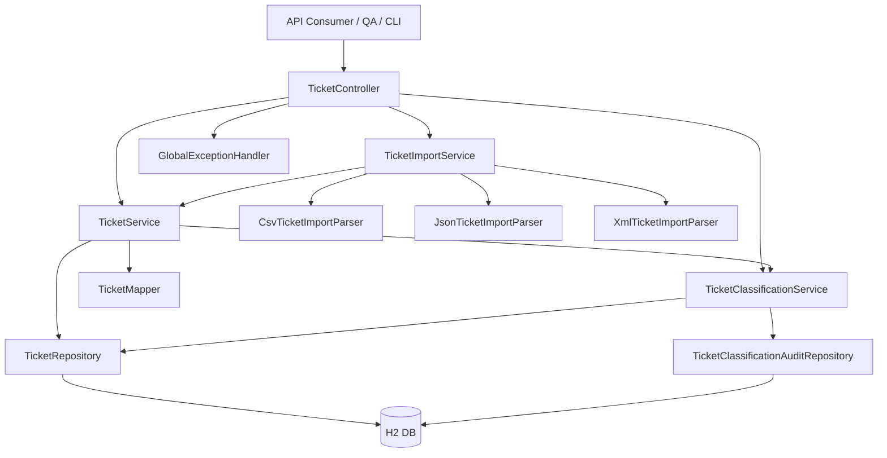
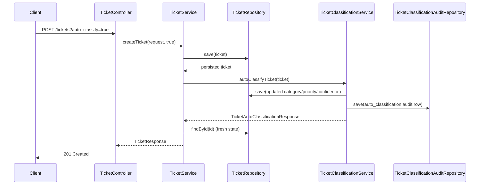
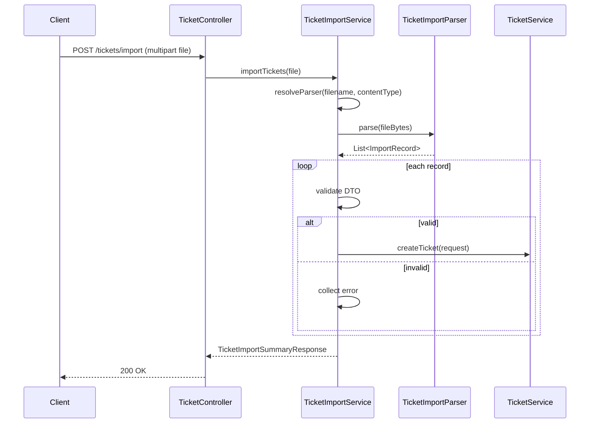

# Architecture

## System context

The service is a monolithic Spring Boot application exposing REST APIs for ticket lifecycle management, import workflows, and rule-based classification.

## High-level component diagram

## Key components

### API layer

- `TicketController` defines endpoint contracts and query parameter parsing.
- DTOs (`TicketRequest`, `TicketResponse`, import/classification DTOs) are serialized in snake_case.

### Service layer

- `TicketService` handles CRUD, status/resolution timestamp transitions, and manual override detection.
- `TicketImportService` orchestrates parser selection, record validation, and summary/error aggregation.
- `TicketClassificationService` applies deterministic keyword rules, computes confidence, and writes audit records.

### Import parser strategy

- Common contract: `TicketImportParser`.
- Implementations:
  - `CsvTicketImportParser`
  - `JsonTicketImportParser`
  - `XmlTicketImportParser`
- Node and field normalization lives in shared import helpers.

### Persistence layer

- `TicketRepository` uses Spring Data JPA + specifications.
- `TicketSpecifications` supports composable filtering:
  - category
  - priority
  - status
  - customer id/email
  - created-at range
- `TicketClassificationAuditRepository` stores classification/manual override decisions.

## Data flow: create with optional auto-classification

## Data flow: bulk import

## Design decisions and trade-offs

1. **Monolith over microservices**
   - Faster delivery for assignment scope.
   - Lower operational complexity.
2. **Rule-based classification over ML model**
   - Deterministic and explainable reasoning.
   - Easy to test and audit.
   - Less adaptable than trained models for nuanced text.
3. **JPA + specifications**
   - Strong developer productivity for dynamic filters.
   - Adequate for current dataset size.
4. **H2 as default runtime datastore**
   - Zero-setup local execution.
   - In-memory state is non-persistent by default.

## Security considerations

- Bean Validation rejects malformed/invalid input before persistence.
- Controlled enum parsing prevents unexpected category/priority/status values.
- Global exception handler avoids leaking stack traces in API responses.
- No authentication/authorization is currently implemented (future production requirement).

## Performance considerations

- DB indexes added for hot filter dimensions: category, priority, status, created_at.
- Import path validates and processes records sequentially with bounded in-memory summaries.
- Automated performance suite verifies:
  - concurrent create workload (20+ requests)
  - list endpoint response-time threshold.
