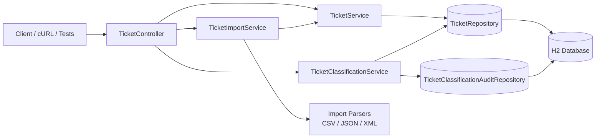

# Intelligent Customer Support System (Homework 2)

**Student Name**: Dmytro Cherneha
**Date Submitted**: 2026-05-16
**AI Tool Used**: Warp Oz agent (`auto` model setting)

Spring Boot API for customer support ticket workflows with CRUD, multi-format import (CSV/JSON/XML), auto-classification, and strict API validation.

## Core capabilities

- Create, read, update, delete support tickets
- Bulk import tickets from CSV/JSON/XML with per-record error reporting
- Auto-classify category + priority with confidence/reasoning output
- Optional auto-classification on create (`autoClassify` / `auto_classify`)
- Filter and paginate ticket lists
- Consistent global error response contract
- Automated tests with JaCoCo verification gate (`>= 85%` line coverage)

## Architecture at a glance



## Technology stack

- Java 25
- Spring Boot 3.5.0
- Spring Web, Validation, Data JPA
- H2 database
- Jackson XML + Apache Commons CSV
- JUnit 5 + Spring Test + JaCoCo

## Quick start

### Prerequisites

- Java 25
- Maven 3.9+

### Build

```bash
mvn -q -DskipTests compile
```

### Run service

```bash
mvn spring-boot:run
```

Defaults:

- API: `http://localhost:8080`
- H2 console: `http://localhost:8080/h2-console`
- JDBC URL: `jdbc:h2:mem:tickets;DB_CLOSE_DELAY=-1;DB_CLOSE_ON_EXIT=FALSE`
  Detailed guide: [Build, Run, Stop, and Browser Testing Guide](docs/build_run_stop_browser_test_guide.md)

## Testing

```bash
# full test suite
mvn test

# full verification (includes JaCoCo coverage check)
mvn verify

# selected suites
mvn -Dtest=TicketApiTest,TicketWorkflowIntegrationTest test
```

## Sample data deliverables

- `sample_tickets.csv` (50 records)
- `sample_tickets.json` (20 records)
- `sample_tickets.xml` (30 records)
- `invalid_tickets.csv`
- `invalid_tickets.json`
- `invalid_tickets.xml`

## Repository layout

```text
src/
  main/java/com/homework2/support/
    api/
    classification/
    domain/
    error/
    importer/
    repository/
    service/
  test/java/com/homework2/support/
    api/
    classification/
    error/
    importer/
    integration/
    model/
    performance/
    repository/
    service/
  test/resources/
    fixtures/
docs/
  java_implementation_plan.md
  system_prompt.md
```
