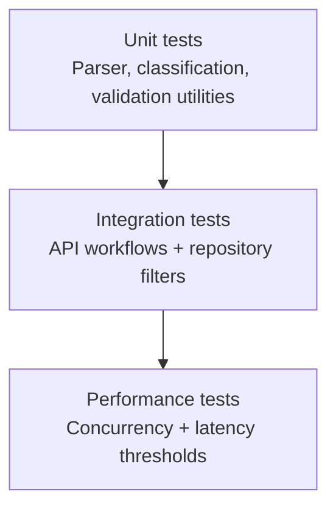

# Testing Guide

This guide explains how to execute and validate automated and manual tests for the Intelligent Customer Support System.

## Test strategy



## Automated test suites

Current test groups include:

- API tests: `TicketApiTest`
- Validation/model tests: `TicketModelValidationTest`
- Import parser tests:
  - `CsvImportParserTest`
  - `JsonImportParserTest`
  - `XmlImportParserTest`
  - `TicketImportUtilitiesTest`
- Classification tests: `TicketClassificationServiceTest`
- Import service tests: `TicketImportServiceTest`
- Repository/specification tests: `TicketSpecificationsIntegrationTest`
- Integration workflow tests: `TicketWorkflowIntegrationTest`
- Performance tests: `TicketPerformanceTest`
- Error contract tests: `GlobalExceptionHandlerTest`

## How to run tests

### Full suite

```bash
mvn test
```

### Full verification + coverage gate

```bash
mvn verify
```

### Run targeted suites

```bash
mvn -Dtest=TicketApiTest,TicketWorkflowIntegrationTest test
mvn -Dtest=TicketPerformanceTest test
```

## Coverage requirement

- JaCoCo check is configured in Maven `verify`.
- Current enforced minimum: line coverage `>= 0.85`.

## Test data locations

- API contract fixtures: `src/test/resources/fixtures/api`
- Deliverable sample datasets:
  - `sample_tickets.csv`
  - `sample_tickets.json`
  - `sample_tickets.xml`
- Negative fixtures:
  - `invalid_tickets.csv`
  - `invalid_tickets.json`
  - `invalid_tickets.xml`

## Manual testing checklist

1. Start app with `mvn spring-boot:run`.
2. Create a ticket (`POST /tickets`).
3. Fetch created ticket (`GET /tickets/{id}`).
4. Update ticket status to resolved (`PUT /tickets/{id}`) and verify `resolved_at`.
5. Trigger auto-classification (`POST /tickets/{id}/auto-classify`).
6. Upload valid sample import file (`POST /tickets/import`).
7. Upload invalid sample import file and verify error list.
8. Test filtered search (`GET /tickets?category=...&priority=...`).
9. Delete a ticket and verify `404` on subsequent get.
10. Check malformed request handling returns standardized error payload.

## Performance benchmark targets

| Scenario                         | Automated test                                                                   | Target threshold |
| -------------------------------- | -------------------------------------------------------------------------------- | ---------------- |
| Concurrent creates (25 requests) | `TicketPerformanceTest.handlesTwentyPlusConcurrentCreateRequestsWithinThreshold` | `< 12s`          |
| List endpoint latency            | `TicketPerformanceTest.listEndpointRespondsWithinStableThreshold`                | `< 3s`           |

## Troubleshooting

- If tests fail due stale DB state, rerun with clean lifecycle:
  ```bash
  mvn clean test
  ```
- If coverage check fails, inspect:
  - `target/site/jacoco/index.html`
  - `target/site/jacoco/jacoco.csv`
- For single test diagnostics:
  ```bash
  mvn -Dtest=ClassName#methodName test
  ```
