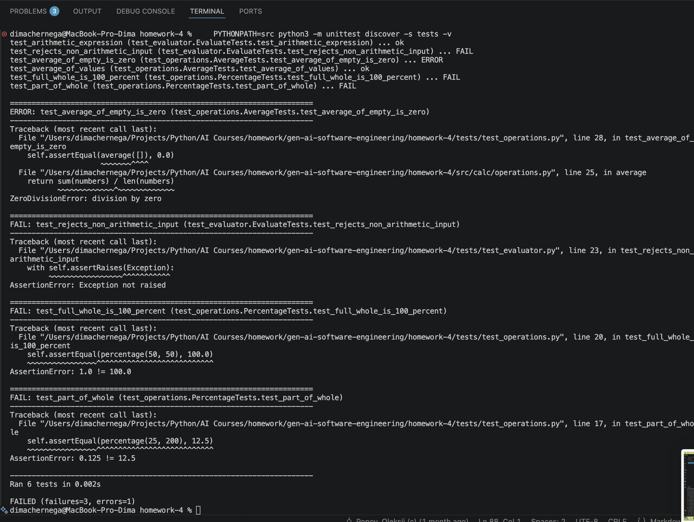

# Homework 4 — 4-Agent Bug-Fix Pipeline

**Student:** Dmytro Cherneha
**Course:** GenAI & Agentic AI for Software Engineering
**Date:** 2026-06-25

## Overview

This homework implements a **4-agent bug-fix pipeline** that runs end-to-end from
a **single command**, with no manual per-agent invocation between steps. Each
agent is a Markdown "agent card" (`agents/*.agent.md`) with an explicit model and
toolset, and two reusable **skills** encode the rubrics the agents must follow.

The pipeline operates on a tiny, dependency-free Python CLI (`calc`, in `src/`)
that intentionally ships with **2 functional bugs and 1 security vulnerability**,
so the pipeline produces concrete before/after results.

The four required agents are the **Bug Research Verifier**, **Bug Fixer**,
**Security Vulnerabilities Verifier**, and **Unit Test Generator**. The **Bug
Researcher** and **Bug Planner** are upstream roles (out of scope for this
homework); their outputs are provided as inputs in the bug folder.

## Single-command execution

```bash
./run-pipeline.sh 001
```

`run-pipeline.sh` launches each agent in order via the `claude` CLI, runs it on
the model declared in its frontmatter, **auto-loads the skills it references**,
and **gates between stages** on the verdict each agent writes (stopping on
failure). Full instructions are in [HOWTORUN.md](HOWTORUN.md).

## Agents & model selection

Each agent declares its model in its `*.agent.md` frontmatter. The rule: spend a
**stronger reasoning model** where mistakes are expensive (verification,
security), and a **faster/cheaper model** for mechanical execution and
scaffolding.

| Agent                 | File                                  | Model    | Why this model                                                                                                                              |
| --------------------- | ------------------------------------- | -------- | ------------------------------------------------------------------------------------------------------------------------------------------- |
| Bug Research Verifier | `agents/research-verifier.agent.md`   | `opus`   | Fact-checking is high-stakes reasoning; a stronger model avoids rubber-stamping bad references/snippets (false approvals) and false alarms. |
| Bug Fixer             | `agents/bug-fixer.agent.md`           | `sonnet` | Mechanical execution of a precise before/after plan — a faster, cheaper model is sufficient and economical.                                 |
| Security Verifier     | `agents/security-verifier.agent.md`   | `opus`   | Adversarial reasoning that must maximise vulnerability recall (false negatives are costly).                                                 |
| Unit Test Generator   | `agents/unit-test-generator.agent.md` | `sonnet` | Bounded, pattern-driven test scaffolding against already-identified changes, following FIRST.                                               |
| Orchestrator          | `agents/orchestrator.agent.md`        | `sonnet` | Control flow + light reasoning: read verdicts, gate, stop on failure.                                                                       |

## Skills

- `skills/research-quality-measurement.md` — quality levels (L1–L4), per-claim
  status labels, scoring (RAR/SFR), and PASS/FAIL mapping. Used by the Research
  Verifier.
- `skills/unit-tests-FIRST.md` — the FIRST principles (Fast, Independent,
  Repeatable, Self-validating, Timely) with a checklist and reporting format.
  Used by the Unit Test Generator.

## Sample application (`calc`)

A minimal Python 3 (stdlib-only) calculator CLI. Seeded issues (catalogued in
`context/bugs/001/bug-context.md`):

| ID    | Type                | Location (before)           | Symptom                                                          |
| ----- | ------------------- | --------------------------- | ---------------------------------------------------------------- |
| BUG-1 | Logic               | `src/calc/operations.py:17` | `percentage()` omits `* 100` → `percent 25 200` returned `0.125` |
| BUG-2 | Edge case           | `src/calc/operations.py:25` | `average([])` raised `ZeroDivisionError`                         |
| SEC-1 | Security (CRITICAL) | `src/calc/evaluator.py:16`  | `evaluate()` used `eval()` → arbitrary code execution            |

**Before:** test suite reported 2 passing, 4 red.
**After (pipeline applied):** all **39 tests pass**; `percent 25 200 → 12.5`,
`average` of `[]` → `0.0`, and `eval "__import__('os').getcwd()"` → `ValueError`.

## Pipeline artifacts (bug 001)

Inputs (provided): `bug-context.md`, `research/codebase-research.md`,
`implementation-plan.md`. Outputs (generated by the run):

| Stage | Agent               | Output                                           | Result                                                   |
| ----- | ------------------- | ------------------------------------------------ | -------------------------------------------------------- |
| 1     | Research Verifier   | `research/verified-research.md`                  | PASS — Research Quality **L4 (100%)**                    |
| 2     | Bug Fixer           | `fix-summary.md`                                 | All 3 changes applied (matches plan)                     |
| 3     | Security Verifier   | `security-report.md`                             | PASS — 0 CRITICAL/HIGH; 1 LOW (`**` DoS), 2 INFO         |
| 4     | Unit Test Generator | `test-report.md` + `tests/test_bug_001_fixes.py` | 33 new tests; full suite **39 passing**, FIRST-compliant |

## Project structure

```
homework-4/
├── README.md                     # this file
├── HOWTORUN.md                   # step-by-step run guide
├── run-pipeline.sh               # single-command orchestrator (all 4 agents in order)
├── agents/
│   ├── orchestrator.agent.md
│   ├── research-verifier.agent.md
│   ├── bug-fixer.agent.md
│   ├── security-verifier.agent.md
│   └── unit-test-generator.agent.md
├── skills/
│   ├── research-quality-measurement.md
│   └── unit-tests-FIRST.md
├── context/bugs/001/
│   ├── bug-context.md                    # input (seeded issues)
│   ├── research/codebase-research.md     # input (Bug Researcher)
│   ├── research/verified-research.md     # output (Stage 1)
│   ├── implementation-plan.md            # input (Bug Planner)
│   ├── fix-summary.md                    # output (Stage 2)
│   ├── security-report.md                # output (Stage 3)
│   └── test-report.md                    # output (Stage 4)
├── src/
│   ├── README.md
│   └── calc/                             # the sample app (fixed)
│       ├── __init__.py  __main__.py  cli.py  evaluator.py  operations.py
├── tests/
│   ├── test_operations.py                # initial (before-state)
│   ├── test_evaluator.py                 # initial (before-state)
│   └── test_bug_001_fixes.py             # generated by Stage 4 (33 tests)
└── docs/screenshots/                     # pipeline run, fixes, security, tests
```

## AI tools used

- **Claude Code (`claude`)** — the runtime for the four pipeline agents. Each
  stage runs headlessly on its declared model (`opus`/`sonnet`), with the agent's
  instructions + skills injected via `--append-system-prompt`.
- **Warp (Oz)** — used to author the agents, skills, the `run-pipeline.sh`
  orchestrator, and the `calc` sample app, and to verify the results.

## Notes / challenges

- In headless `acceptEdits` mode the Claude Code agents could not get approval to
  run `python3`, so the Bug Fixer and Unit Test Generator recorded test
  **execution** as BLOCKED and relied on static analysis. The source fixes were
  applied correctly; the full suite (**39 tests**) was then verified to pass with
  `PYTHONPATH=src python3 -m unittest discover -s tests -v`.
- The Security Verifier additionally flagged a LOW-severity `**` (exponentiation)
  DoS as a hardening note beyond the seeded CRITICAL, which is now closed.

## Screenshots

See `docs/screenshots/` for evidence of the run:




Other captures in the same folder: `stage 3 error.png`, `run failed.png`,
`1.png`, `2.png`, `3.png`.
